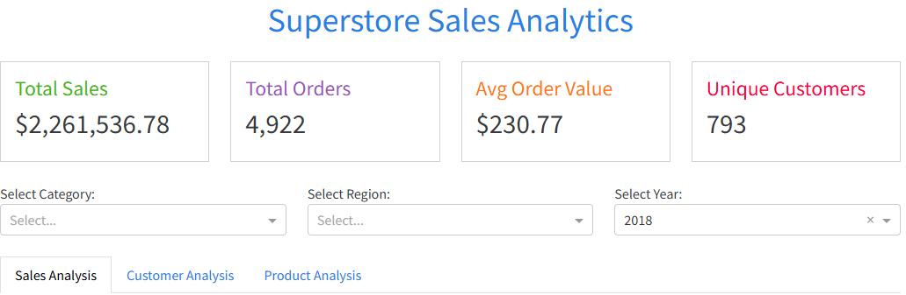
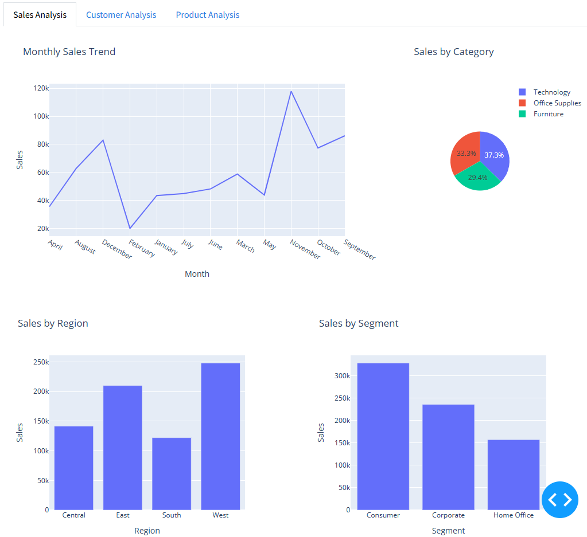
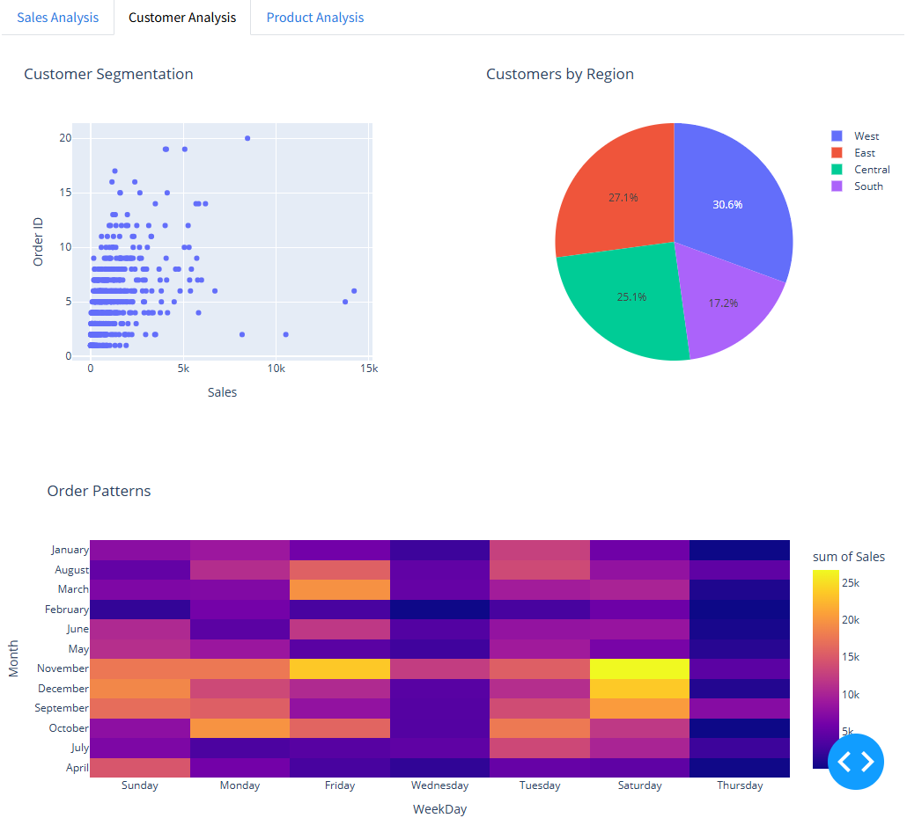
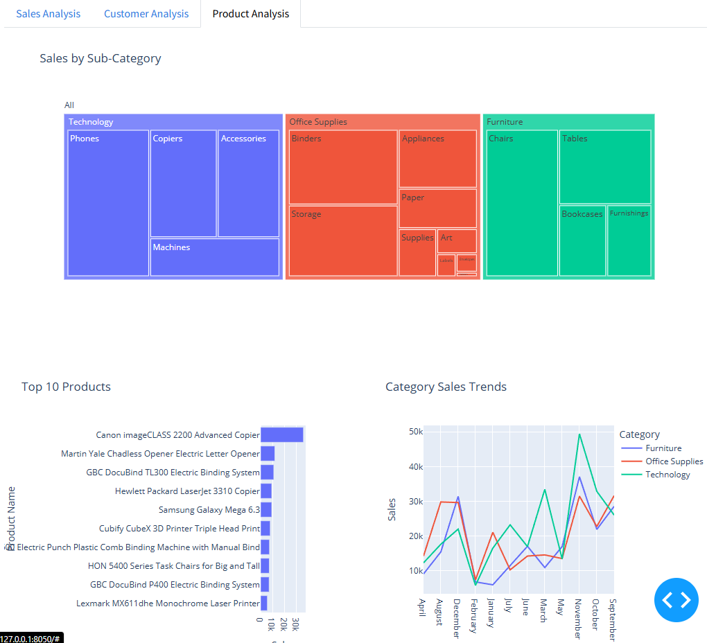

# Superstore Sales Analytics Dashboard

An interactive dashboard built with Python and Dash to analyze Superstore sales data.

## Features

- Sales Analysis

  - Monthly sales trends
  - Category breakdown
  - Regional analysis
  - Segment performance

- Customer Analysis

  - Customer segmentation
  - Regional distribution
  - Order patterns

- Product Analysis

  - Subcategory performance
  - Top products
  - Category trends

## Installation

1. Clone the repository:
```bash
git clone https://github.com/rishi-kulkarni14/Data-analysis-dashboard-using-python.git
cd superstore-dashboard
```

2. Create a virtual environment:
```bash
python -m venv venv
source venv/bin/activate  # On Windows: venv\Scripts\activate
```

3. Install dependencies:
```bash
pip install -r requirements.txt
```

4. Run the dashboard:
```bash
python app.py
```

5. Open your browser and navigate to:
```
http://localhost:8050
```

## Data

The dashboard uses the Superstore Sales dataset with the following features:
- Order details (ID, Date, Ship Date)
- Customer information (ID, Name, Segment)
- Product details (Category, Sub-Category, Product Name)
- Sales metrics

## Technologies Used

- Python
- Dash
- Plotly
- Pandas
- NumPy
- Dash Bootstrap Components


Rishi Kulkarni
